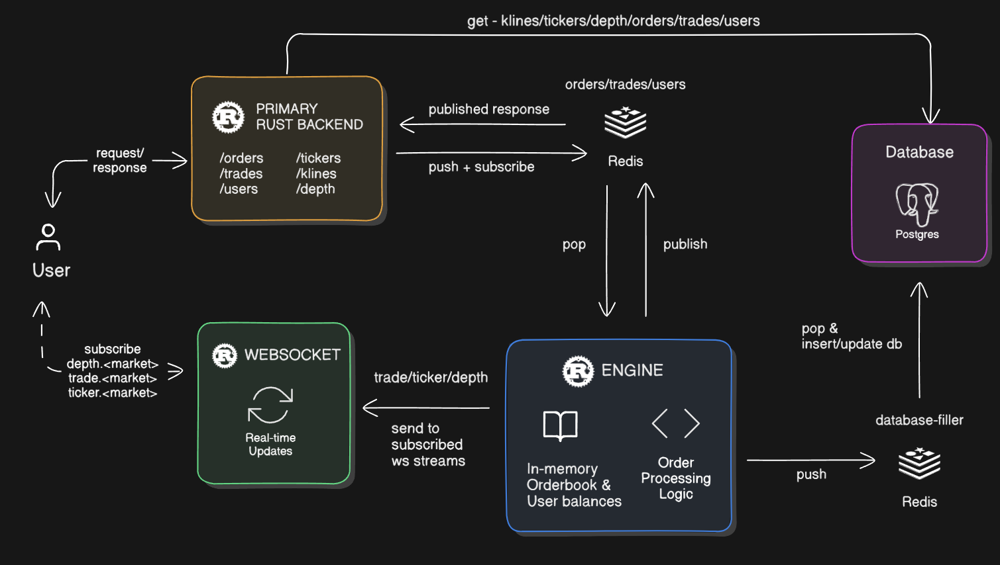
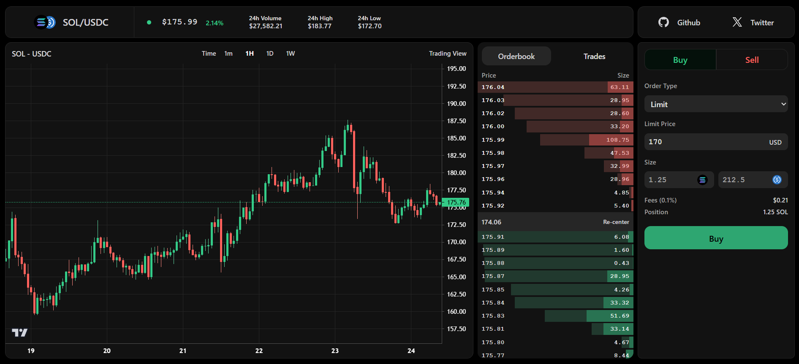
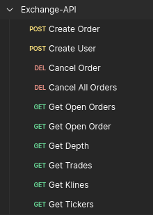

<h1 align="center">Exchange⚡</h1>

<p align="center">
    🚀 A high-performance centralized cryptocurrency exchange built in Rust.
    <br /> <br />
    <a href="#introduction"><strong>Introduction</strong></a> ·
    <a href="#architecture"><strong>Architecture</strong></a> ·
    <a href="#user-interface"><strong>User Interface</strong></a> ·
    <a href="#features"><strong>Features</strong></a> ·
    <a href="#tech-stack"><strong>Tech Stack</strong></a> ·
    <a href="#api-endpoints"><strong>API Endpoints</strong></a> ·
    <a href="#order-matching--execution"><strong>Order Matching & Execution</strong></a> ·
    <a href="#contributing"><strong>Contributing</strong></a> ·
    <a href="#local-development"><strong>Local Development</strong></a> ·
    <a href="#license"><strong>License</strong></a>
</p>

## Introduction

Exchange is a low-latency centralized cryptocurrency exchange designed for high-frequency trading (HFT). Built in Rust, it features an in-memory order book, real-time WebSocket updates, and an optimized backend powered by Redis and Postgres for maximum efficiency.

## Architecture



## User Interface

A separate trading UI can sit on top of this stack (REST and WebSocket APIs). This repository ships the backend services only.



## Features

- ⚡ **Ultra-fast Order Matching** – Sub-10ms order execution.
- 🏦 **In-memory Order Book & Balances** – Ensures low latency and high throughput.
- 🔥 **Real-time WebSockets** – Live updates for market depth, trades, and tickers.
- 📈 **Advanced Matching Engine** – Optimized price-time priority order matching.
- 🔄 **Fault-tolerant Architecture** – Redis-backed pub/sub and persistent Postgres storage.
- 🔌 **Efficient API Layer** – REST & WebSocket APIs for seamless integration.

## Tech Stack

- [Rust](https://www.rust-lang.org/) – Core language for speed and memory safety.
- [Redis](https://redis.io/) – High-speed pub/sub and caching layer.
- [Postgres](https://www.postgresql.org/) – Persistent storage for trade history and user balances.
- [Tokio](https://tokio.rs/) – Asynchronous runtime for high-performance networking.
- [Actix](https://actix.rs/) – Web framework for API handling.
- [Tokio-Tungstenite - WebSockets](https://github.com/snapview/tokio-tungstenite) – Real-time data streaming.
- [Serde](https://serde.rs/) – Serialization/deserialization of structured data.
- [SQLx](https://github.com/launchbadge/sqlx) – Database interaction with async support.
- [Fred (Pub/Sub)](https://github.com/aembke/fred.rs) – Efficient Redis client for messaging.

### Components

1. **Primary Rust Backend**

   - Handles REST API and WebSocket requests.
   - Routes requests to Order Management, User Balances, and Market Data services.
   - Publishes responses via Redis.

2. **Redis**

   - Acts as a message queue for real-time order processing.
   - Temporarily stores market data (active orders, tickers).
   - Manages pub/sub for market data updates.

3. **Postgres**

   - Persistent storage for trade history, balances, and order data.
   - Updated asynchronously to avoid performance bottlenecks.

4. **WebSocket Layer**

   - Streams market depth, ticker data, and trade executions.
   - Pushes updates in real time to connected clients.

5. **Matching Engine**
   - Maintains in-memory order books.
   - Executes trades using price-time priority.
   - Manages the order lifecycle (creation, execution, cancellation).

## API Endpoints



### Order Management

- `POST /api/v1/order` → Create/Execute a new order
- `GET /api/v1/order` → Get details of an order
- `DELETE /api/v1/order` → Cancel an active order
- `GET /api/v1/orders` → Get open orders for a user
- `DELETE /api/v1/orders` → Cancel all orders for a user

### Market Data

- `GET /api/v1/klines` → Get kline (candlestick) data
- `GET /api/v1/depth` → Get order book depth
- `GET /api/v1/trades` → Get recent trades
- `GET /api/v1/tickers` → Get market tickers

### User Management

- `POST /api/v1/users` → Create a new user
- `POST /api/v1/user/deposit` → Deposit funds (pending)
- `POST /api/v1/user/withdraw` → Withdraw funds (pending)

## Order Matching & Execution

#### **Data Structures**

```rust
struct Engine {
  orderbooks: Vec<Orderbook>,
  balances: BTreeMap<String, UserBalances>,
}

struct Orderbook {
    bids: BTreeMap<Decimal, Vec<Order>>,
    asks: BTreeMap<Decimal, Vec<Order>>,
    asset_pair: AssetPair,
    last_update_id: i64,
}

struct Order {
    order_id: String,
    user_id: String,
    symbol: String,        // e.g., SOL_USDC
    side: String,          // Buy/Sell
    order_type: String,    // Limit/Market
    order_status: String,
    quantity: Decimal,
    filled_quantity: Decimal,
    price: Decimal,
    timestamp: i64,
}

struct Amount {
  available: Decimal,
  locked: Decimal,
}

struct UserBalances {
  user_id: String,
  balance: HashMap<Asset, Amount>,
}
```

#### Order Execution Flow

- Orders are processed asynchronously using Rust’s `tokio`.
- The engine pops new orders from Redis and checks the order book.
- If a match is found, trade execution happens.
- Trades and balances are published via Redis for WebSocket updates.
- Final orderbook state is stored in Postgres.

## Contributing

We love our contributors! Here's how you can contribute:

- Open an issue in this repository if you believe you've encountered a bug.
- Follow the [local development setup guide](#local-development) below to get your local dev environment set up.
- Open a pull request to add new features, improve quality of life, or fix bugs.

## Local Development

```sh
git clone <YOUR_REPO_URL>
cd ferrum
cargo build
cp .env.example .env   // Configure Postgres and Redis credentials in .env.
docker-compose up -d
cargo run
```

## Deployment

- Production deployment is handled by GitHub Actions (see `.github/workflows/production.yml`).
- Add the following secrets to your GitHub repository:
  - `DOCKER_USERNAME`
  - `DOCKER_PASSWORD`
  - `PAT` (Personal Access Token with `repo` scope for pushing deploy manifests)
  - `DEPLOY_MANIFESTS_REPO` (GitHub path `owner/repo` for the manifests repository that receives image tag updates)

## License

This project is open-source under the MIT License. See `LICENSE.md` in the repository root.
